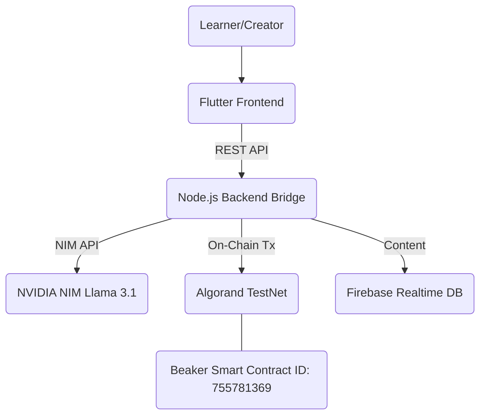
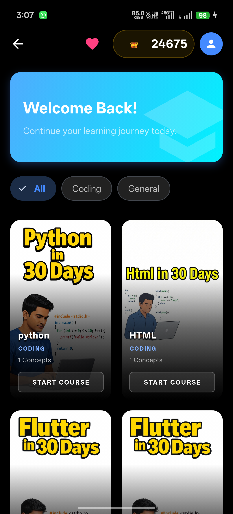
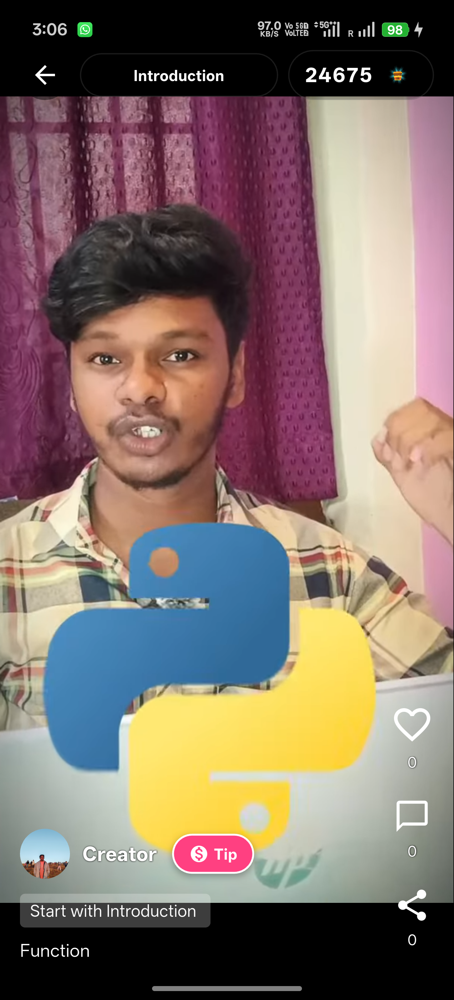
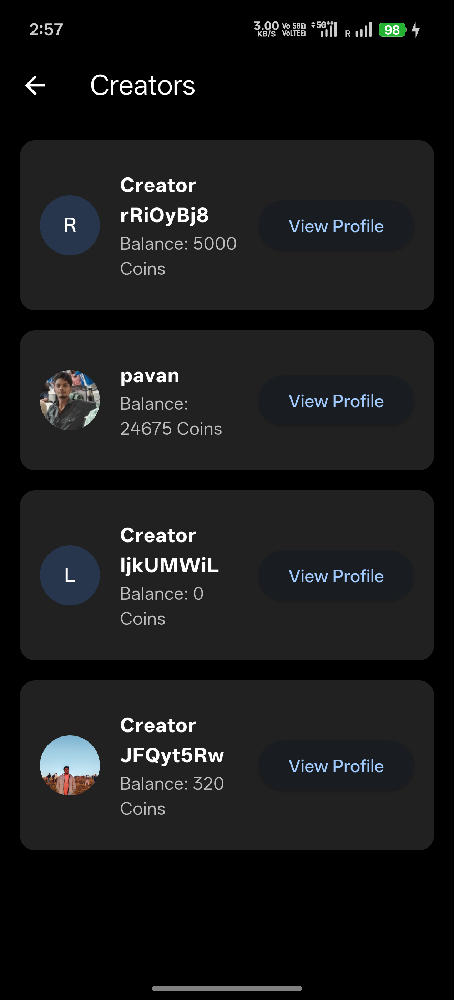
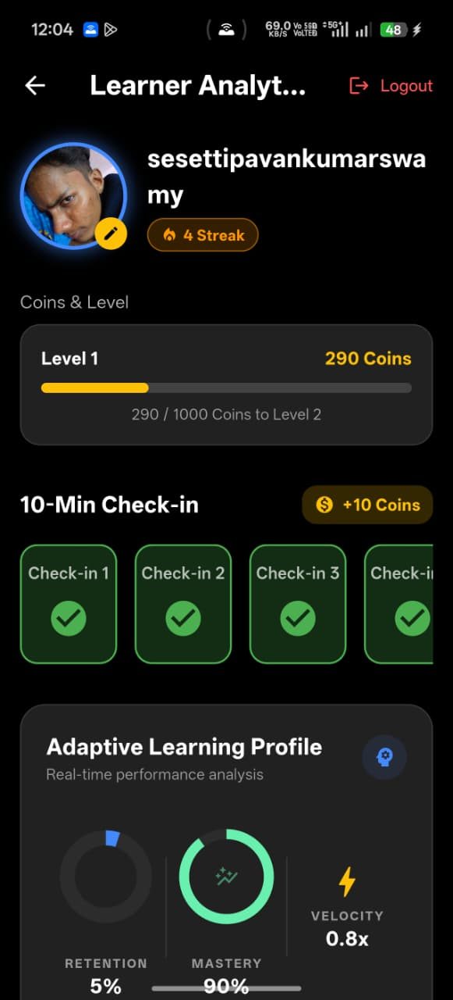
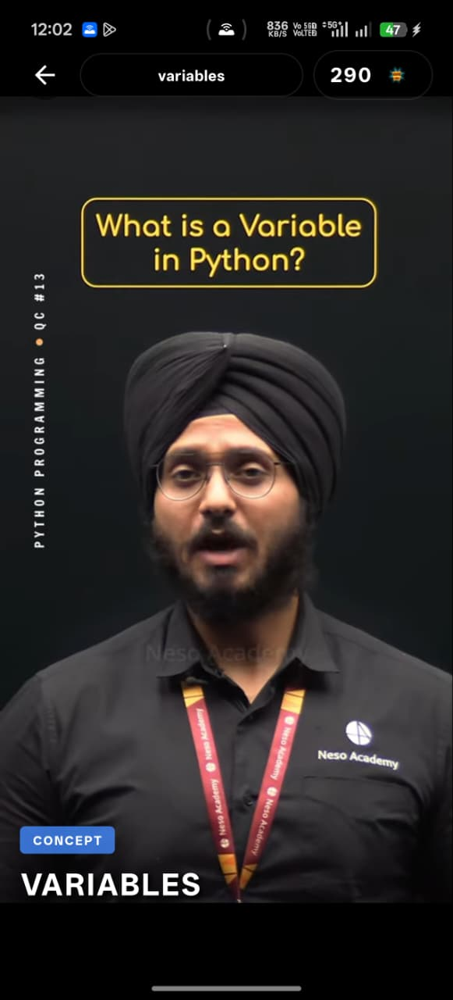
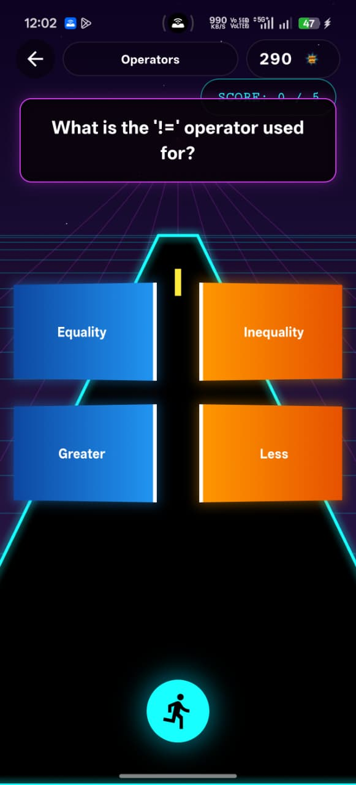
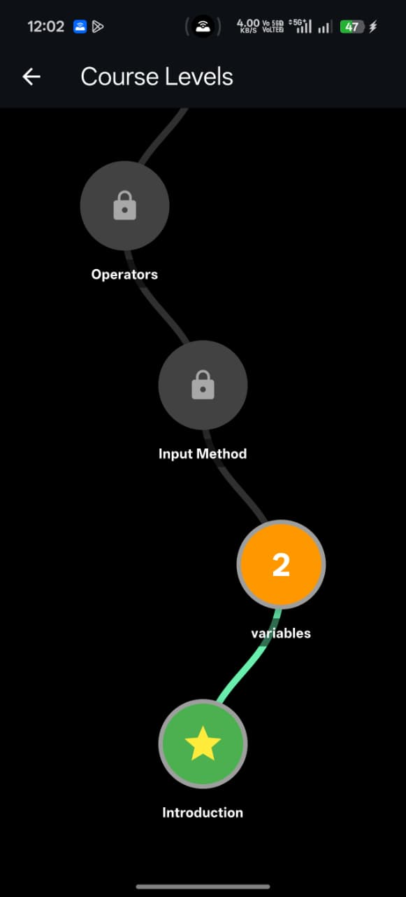
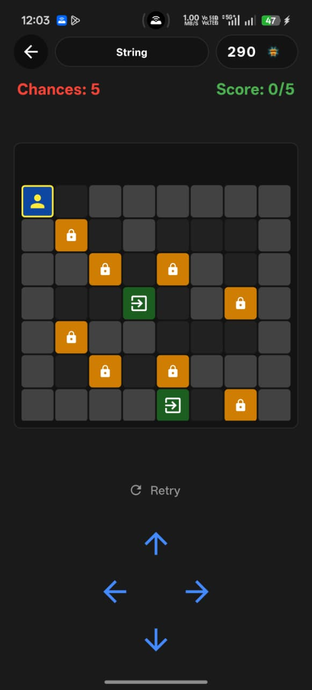

# SmartLearn 🎓 - RIFT 2026 Hackathon Submission

**SmartLearn** is a gamified, AI-powered educational platform where learners discover high-quality content and creators receive direct, transparent incentivization via the **Algorand Blockchain**.

---

### 🏆 RIFT Hackathon Details
- **Project Title**: SmartLearn
- **Track**: Web3 / Blockchain Open Innovation Track (Build on Algorand)
- **Problem Statement**: **Incentivizing Quality Educational Content & Learner Engagement.**
  - *Description*: Current online learning platforms suffer from a monetization gap for educators, lack of transparency in tippng, and low learner engagement. SmartLearn solves this by combining **NVIDIA AI-generated** gaming content with a seamless **Algorand on-chain tipping** mechanism.
- **App ID (Testnet)**: `755781369`
- **Explorer Link**: [Pera Explorer (Testnet)](https://testnet.explorer.perawallet.app/application/755781369)
- **Live Demo (Frontend)**: [SmartLearn App Demo]([https://pavankumarswamy.github.io/aa/](https://drive.google.com/file/d/1K2jMFAziFwaN1GloT3-1QjRpEtNAldFs/view?usp=sharing))
- **Live Demo (Backend)**: [TipJar Backend (HF Spaces)](https://shesettipavankumarswamy-tipjarbackend.hf.space)
- **LinkedIn Demo Video**: [Watch the Demo on LinkedIn]([https://www.linkedin.com/company/rift-pwioi/](https://www.linkedin.com/posts/pavankumarswamy-sheshetti-12b129253_rift2026-algorand-algokit-ugcPost-7430402137982943232-39vs?utm_source=social_share_send&utm_medium=android_app&rcm=ACoAAD59G3MBYnfR2PWYjbEFr2n-xw0h20Fxsnk&utm_campaign=whatsapp)) *(Replace with actual video link)*

---

## 🏗️ Architecture Overview

The SmartLearn ecosystem uses a hybrid architecture to balance real-time educational delivery with secure Web3 transactions.



**Interaction Flow:**
1. **Account Creation**: Backend generates an Algorand wallet for every user and encrypts the private key (AES-256-CBC).
2. **AI Generation**: **NVIDIA NIM (Llama 3.1 405B)** dynamically generates quests and reels based on course concepts.
3. **On-Chain Tipping**: Users send tips via the backend bridge, which decrypts the sender's key, signs the transaction, and submits it to Algorand TestNet.
4. **Verification**: Every tip is a verifiable transaction confirmed on-chain in ~4 seconds with sub-cent fees.

---

## 🚀 Key Features

- **AI-Powered Learning Feed**: Personalized courses and reels generated via Llama 3.1.
- **On-Chain Tipping Mechanism**: Direct creator payments powered by **Algorand Beaker** smart contracts.
- **Gamified Educational Questing**: 6+ adapter game modes (Maze of Minds, Orbital Relay, etc.) to reinforce knowledge.
- **Custodial Web3 UX**: Seamless onboarding using a custodial wallet model — no seed phrases required for students.
- **Admin Dashboard**: Comprehensive tools for managing courses, users, and monitoring on-chain transaction health.

---

## 📸 App Screenshots

<div align="center">
  
  
  
  
</div>
<div align="center">
  
  
  
  
</div>

---

## 🛠️ Tech Stack & Backend Services

| Layer | Technology |
|-------|------------|
| **Blockchain** | Algorand (TestNet) |
| **Development Toolkit** | **AlgoKit 2.10.2** |
| **Smart Contracts** | PyTEAL 0.24.1 / Beaker 1.1.1 |
| **Frontend** | Flutter (Material 3), Provider (State Management) |
| **Backend Bridge** | Node.js 18+ / Express.js (Dockerized on HF Spaces) |
| **AI Engine** | NVIDIA NIM API (Llama 3.1) |
| **Database** | Firebase Realtime Database & Firestore |
| **Media** | Cloudinary & YouTube Data API |

---

## 📜 Smart Contract Details

| Property | Value |
|----------|-------|
| **App ID (TestNet)** | `755781369` |
| **App Address** | `443G2NRFJAMO6RAFSAPILVAGTI7N3N7ZG63UYT22ATUIWUUXY57ZX25MAA` |
| **Contract Methods** | `create()`, `tip(payment)`, `get_total_tips()`, `get_tip_count()` |
| **Global State** | `total_tips` (uint64), `total_tip_count` (uint64) |

---

## 🚥 Installation & Setup

### Prerequisites
- Flutter SDK (latest stable)
- Node.js 18+ & Python 3.10+
- **AlgoKit CLI** (`pip install algokit`)

### 1. Backend & Smart Contract Setup
```bash
cd backend/tipjarbackend
npm install
# Set your deployer mnemonic
export DEPLOYER_MNEMONIC="your mnemonic..."
# Compile and deploy Beaker contract
py smart_contract/deploy.py
# Start local bridge
npm start
```

### 2. Frontend Setup
```bash
# In the root smartlearn directory
flutter pub get
# Create .env with NV_API_KEY and CLOUDINARY_URL
flutter run
```

---

## 📖 Usage Guide

1.  **Onboarding**: Sign up; your custodial Algorand wallet is automatically initialized.
2.  **Learn**: Consume AI-curated reels and course content.
3.  **Play**: Conquer educational games to earn engagement points.
4.  **Tip**: Hit the **"Tip"** button on creator profiles. This triggers the Node.js bridge to sign an on-chain payment to the creator's Algorand address.
5.  **Track**: Verify your transaction hash directly on the [Pera Explorer](https://testnet.explorer.perawallet.app/).

---

## 📁 Project Structure

```text
├── backend/tipjarbackend/     # Node.js Bridge & AlgoKit Smart Contracts
│   ├── algorand/              # Transaction & Wallet logic
│   └── smart_contract/        # PyTEAL/Beaker source & Deploys
├── lib/                       # Flutter Frontend
│   ├── games/                 # Gamified learning implementations
│   ├── screens/               # UI Layer (Admin & User)
│   └── services/              # AI & Backend API connectors
└── README.md
```

---

## 👥 Team: Apex Achievers

- **Manoj Kumar** (Team Lead)
- **YogaVinay**
- **Pavan** 
- **Pavankumarswamy** 
- **RIFT 2026 Team**: Supporting Mentors & Organizers.

---

*Built for RIFT 2026 Hackathon — Innovating the Future of Learning on Algorand.*
